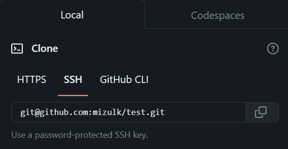

# 测试git团队协作的一个远程仓库

## 视频教程
[尚硅谷Git入门到精通全套教程（涵盖GitHub\Gitee码云\GitLab）-哔哩哔哩](https://b23.tv/JoFyPIN)

**GitLab可以不用看**

## 克隆到本地命令
在使用该测试仓库时，请将该仓库克隆到本地进行更改
新建一个文件夹，进入该文件夹，右键>显示更多选项>Git bash here
输入克隆命令：
```
git clone https://github.com/mizulk/test.git
```
克隆成功后在进行相应的git命令练习或者来测试

## git命令

### `git init`
初始化git本地仓库
该操作回在当前目录下创建.git文件夹
该文件夹是隐藏的，需要在window资源管理器中的查看>显示>显示隐藏的项目

### `git add <file>`
将文件添加到暂存区中（可删除）（不生成版本号）
用`git restore --staged <file>`命令来删除撤销更改

### `git commit -m "message"`
提交所有暂存区中的文件（生成版本号）

### `git status`
查看本地库状态

### `git log`
查看修改日志（很详细）

### `git reflog`
查看精简版的修改日志

### `git reset --hard <head>`
切换至指定版本号（需要完整的）的版本
每次commit都回生成指定的版本号

### `git branch`
显示本地库中所有分支

### `git branch <name>`
创建指定名称的分支，从当前分支上分出

### `git branch -d <branch>`
删除指定名称的分支

### `git checkout <branch>`
切换到指定分支

### `git merge <branch>`
将指定分支合并到当前分支
当同一行被修改时，需要人工进行合并。
会出现如下情况：
```
<<<< branch1
……内容1……
====
……内容2……
>>>> branch2
```
将其中一个内容保存下来（删去所有的大于小于等于号，仅留下你需要的内容即可）
然后输入命令`git add <file>`和`git commit -m "commit message"`来完成合并
你也可以用`git add .`来将所有文件添加到暂存区

### `git remote -v`
显示远程仓库别名

### `git remote add <name> <url>`
为远程仓库其别名

### `git push <remote> <branch>`
将指定的分支提交到远程仓库

###  `git pull <remote> <branch>`
拉取远程仓库的指定分支的代码。
用于更新本地仓库，同步团队中其他人做出的修改

### `git clone <url> <branch>`
克隆指定url的仓库的指定分支

## 可能遇到的问题
```
$ git push test master
fatal: unable to access 'https://github.com/mizulk/test.git/': SSL certificate problem: unable to get local issuer certificate
```
**如果遇到该问题的话请用下面的命令来解决**
`git config --global http.sslVerify false`

## Git常用命令图


## git回退版本
### 三种恢复等级
`--soft`仅指针头
`--mixed`指针头和暂存区
`--hard`全部
### 版本回退
`git reset --hard HEAD^`返回上一个版本
`git reset --hard HEAD^^`返回上上一个版本
`git reset --hard HEAD~3`返回上三个版本
`git reset --hard HEAD~10`返回上十个版本
`git reset --hard <commit>`返回指定版本
版本号可以通过`git reflog`或`git log`来查看
最后用`git push -f`来强制更新远程仓库

## git删除以跟踪的文件
`git rm --cached <文件名>`
`git rm --cached -r <目录>`
删完后在commit即可


## 使用SSH（免密登录）
### 配置SSH
1. 打开Git Bash输入`ssh-keygen -t rsa -b 4096 -C "your_email@example.com"`其中的字符串可以是你的邮箱
2. 一直回车即可，如果之前已经创建国SSH密钥，这需要在最后一部输入yes
3. `cat ~/.ssh/id_rsa.pub`查看公钥并复制(ctrl + ins 或 右键选择复制)
4. 如果没有使用Git Bash的话，请复制C:\Users\用户名\.ssh\id_rsa.pub中的内容
5. 点击你的GitHub头像再点击setting，左侧**SSH and GPG keys**，点击New SSH Key。title随便写（例如a），内容把复制的粘贴上去
6. `ssh -T git@github.com`测试连接，有警告就输入yes

### 使用SSH
#### 新克隆的仓库
例如`git clone git@github.com:mizulk/test.git`


#### 已经克隆下来的仓库
1. 添加远程仓库地址`git remote add ssh git@github.com:mizulk/test.git`
2. pull（拉取）使用`git pull ssh master`
3. push（推送）使用`git push ssh master`